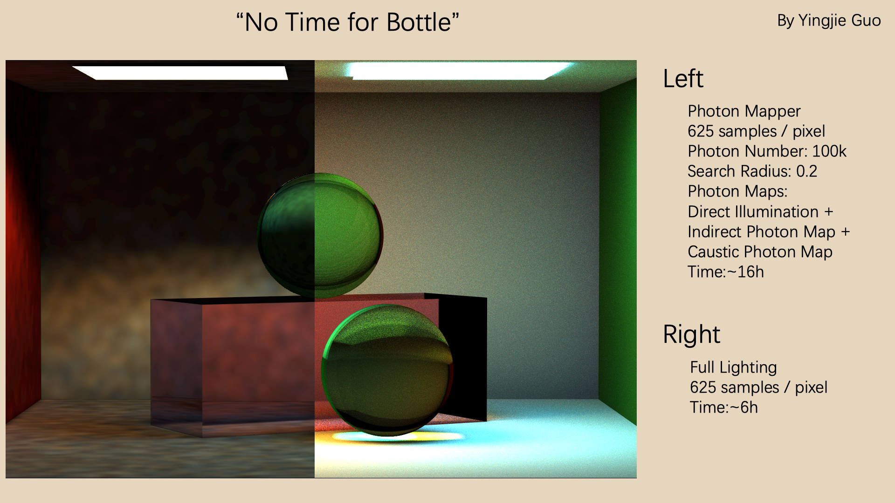
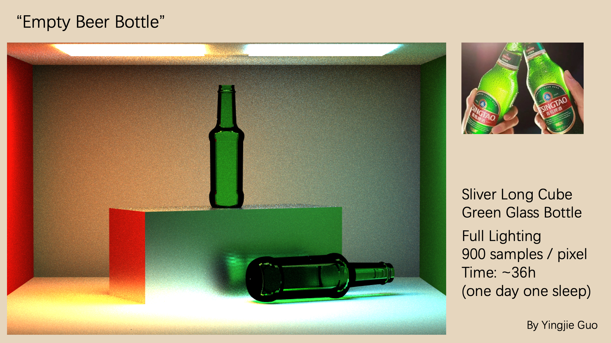
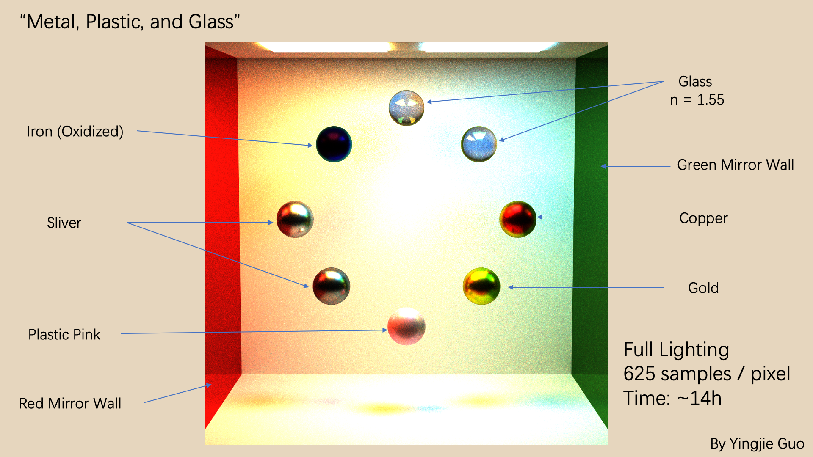
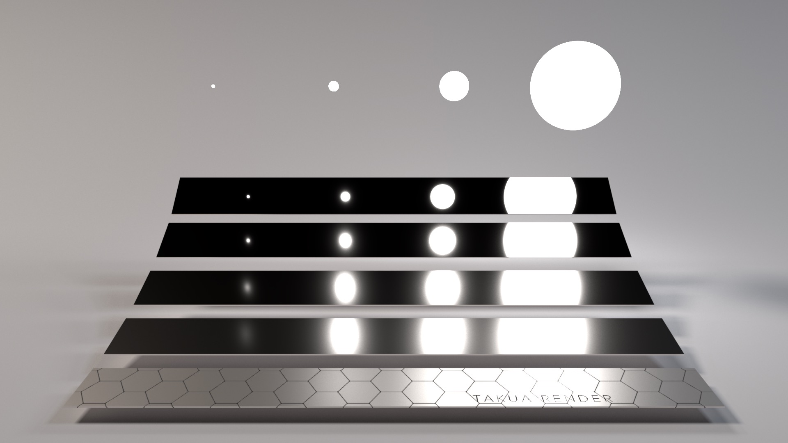
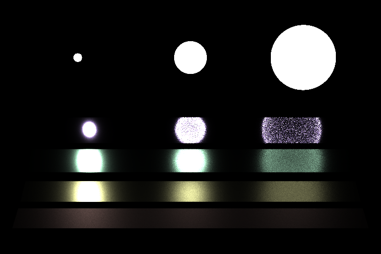
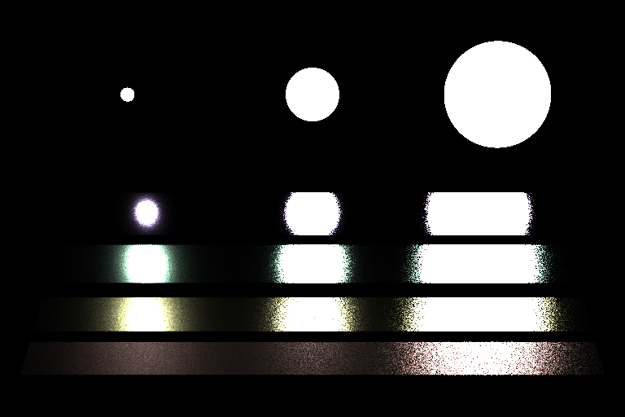

# Render Result Demonstration
### Photon Mapping and Global Illumination

Here is a render result showing a comparison of two render techniques, photon mapping(left) and path tracing(right). 

The photon mapping method has mainly two steps. The first is to store the photon information emitted from the light source or bounced from other surfaces at every point in the scene into a KD-tree. Then in the render process, the neighbor photons' information is collected for a given point in space to calculate its illumination information. 

The path tracing integrator combines the direct illumination in the scene with multiple importance sampling and the indirect illumination to exhibit the global illumination in the scene. To limit the times of bouncing and reduce render time in indirect illumination, the Russian Roulette method is introduced. 

### Materials
The different materials property exhibit in the render result is realized with different bidirectional scattering distribution functions(BSDF). It can be further categorized into bidirectional reflection distribution functions(BRDF) for reflective materials like metal and bidirectional transmission distribution functions(BTDF) to transmissive materials like glass.

### Multiple Importance Sampling
To better estimate direct light illumination, the technique called multiple importance sampling(MIS) is applied. MIS averages the light source sampling method and the BRDF sampling method with proper weight to reduce variance in the rendered result.          
The ["Veach" scene](https://blog.yiningkarlli.com/2015/02/multiple-importance-sampling.html) is commonly used to distinguish the render result with or without using the technique of MIS.

This is a render result without using MIS. The variances of the estimation of the large light source on the specular surface at the top right and the estimation of the small light source on the diffuse surface at the bottom left are too high to accept. 
        

This is a render result using MIS. The variance on the whole render result is acceptable.

